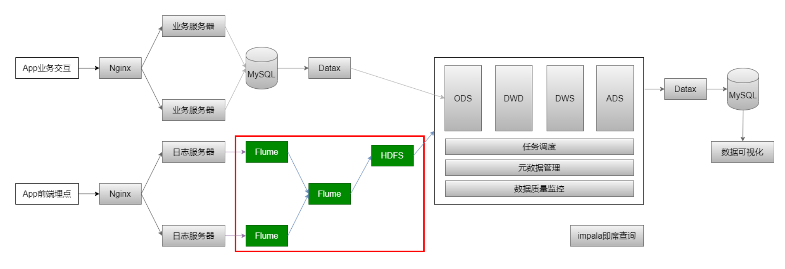
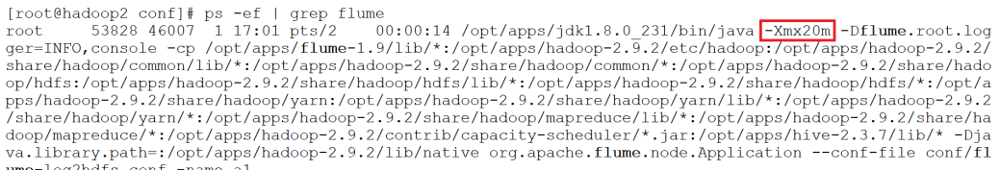
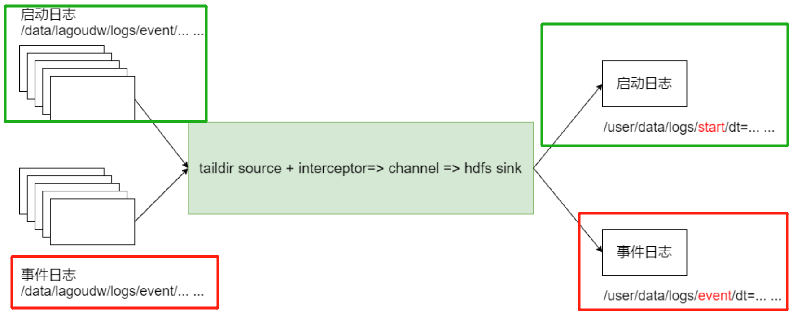

# 电商分析之 会员活跃度

## （一）需求分析

-   会员数据是后期营销很重要的数据。
-   各种网站会员的门槛不一样，电商会员门槛较低，有些电商平台也会推出高级会员等等

**计算指标**：

1.  **新增会员**：每日新增会员数
2.  **活跃会员**：每日、周、月的活跃会员数
3.  **会员留存**：1日、2日、3日的会员<u>留存数</u>和<u>留存率</u>


**指标口径业务逻辑**：

-   **会员：**每个独立设备认为是一个会员（安卓系统根据IMEI号，IOS系统分局OpenUDID）
-   **活跃会员：**打开应用的会员即为活跃会员。在自然周内启动过应用的为周活跃会员，月活跃会员同理。
-   **会员活跃率**：一天内活跃会员数与会员总数之比；同理还有周活跃率（自然周）、月活跃率（自然月）
-   **新增会员**：第一次使用应用的用户。新增会员包括日新增会员、周（自然周）新增会员、月（自然月）新增会员；
-   **会员留存数和留存率**：某段时间的新增会员，经过一段时间后，仍继续使用应用认为是留存会员；这部分会员占当时新增会员的比例为留存率


**已知条件：**

1.  明确了需求
2.  已知输入：启动日志（分析会员时采用）、事件日志
3.  已知输出：新增会员、活跃会员、留存会员
4.  已知数据的分层路径：日志文件 --> ODS --> DWD --> DWS --> ADS（输出）


**确定下一步：**

-   数据采集：**日志文件 --> Flume --> HDFS --> ODS**


## （二）日志数据采集

-   **原始日志数据**（一条启动日志）

```json
2020-07-30 14:18:47.339 [main] INFO com.lagou.ecommerce.AppStart - {"app_active"{"name":"app_active","json": {"entry":"1","action":"1","error_code":"0"},"time":1596111888529},"attr": {"area":"泰安","uid":"2F10092A9","app_v":"1.1.13","event_type":"common","device_id":" 1FB872-9A1009","os_type":"4.7.3","channel":"DK","language":"chinese","brand":"iph one-9"}}
```

-   **数据采集的流程**

<u>选择Flume作为采集日志数据的工具：</u>

-   Flume 1.6
    -   无论是Spooling Directory Source、Exec Source均不能很好的满足动态实时收集的需求

-   **Flume 1.8+**
    -   提供了一个非常好用的 Taildir Source，使用该source，可以监控多个目录，对目录中新写入的数据进行实时采集

---

### 1、taildir source 配置

-   **taildir source 的特点**

    -   使用正则表达式匹配目录中的文件名
    -   监控的文件中，一旦有数据写入，Flume就会将信息写入到制定的sink中
    -   高可靠，不会丢失数据
    -   不会对跟踪文件有任何处理，不会重命名也不会删除
    -   不支持windows，不能读二进制文件，支持按行读取**文本文件**

    

-   **taildir source 的配置**

    -   注意最后是  **`/.*log`** 而不是 ` /*.log`

    ```properties
    a1.sources.r1.type = TAILDIR
    a1.sources.r1.positionFile = /data/lagoudw/conf/startlog_position.json
    a1.sources.r1.filegroups = f1
    a1.sources.r1.filegroups.f1 = /data/lagoudw/logs/start/.*log
    ```
    -   **positionFile**
        -   配置检查点文件的路径，检查点文件会以 json 格式保存已经读取文件的位置，以便断点续传
    -   **filegroups**
        -   可以有多个（因为taildir source 可以同时监控多个目录的文件），以空格分割
    -   **filegroups.**
        -   配置每个filegroups的文件绝对路径，文件名可以用正则表达式

### 2、hdfs sink 配置

```properties
a1.sinks.k1.type = hdfs
a1.sinks.k1.hdfs.path = /user/data/logs/start/%Y-%m-%d/
a1.sinks.k1.hdfs.filePrefix = startlog
a1.sinks.k1.hdfs.fileType = DataStream

# 配置文件滚动方式（文件大小32M）
a1.sinks.k1.hdfs.rollSize = 33554432
a1.sinks.k1.hdfs.rollCount = 0
a1.sinks.k1.hdfs.rollInterval = 0
a1.sinks.k1.hdfs.idleTimeOut = 0
# 避免产生更多小文件
a1.sinks.k1.hdfs.minBlockReplicas = 1

# 向hdfs上刷新的event个数
a1.sinks.k1.hdfs.batchSize = 100

# 使用本地时间
a1.sinks.k1.hdfs.useLocalTimeStamp = true
```

HDFS Sink 都会采用滚动生成文件的方式，滚动生成文件的策略有：

-   基于时间。hdfs.rollInterval 30秒

-   基于文件大小。hdfs.rollSize 1024字节

-   基于event数量。hdfs.rollCount 10个event

-   基于文件空闲时间。hdfs.idleTimeout 0 【0，表示禁用】

-   minBlockReplicas。默认值与 hdfs 副本数一致（一般是3）。设为 **1** 是为了让 Flume 感知不到hdfs的块复制，此时其他的滚动方式配置（时间间隔、文件大小、events数量）才不会受影响

### 3、Agent 配置

-   Agent的配置：综合以上配置
-   编写文件：`/data/lagoudw/conf/flume-log2hdfs1.conf`

```properties
a1.sources = r1
a1.sinks = k1
a1.channels = c1

# taildir source
a1.sources.r1.type = TAILDIR
a1.sources.r1.positionFile = /data/lagoudw/conf/startlog_position.json
a1.sources.r1.filegroups = f1
a1.sources.r1.filegroups.f1 = /data/lagoudw/logs/start/.*log

# memorychannel
a1.channels.c1.type = memory
a1.channels.c1.capacity = 100000
a1.channels.c1.transactionCapacity = 2000

# hdfs sink
a1.sinks.k1.type = hdfs
a1.sinks.k1.hdfs.path = /user/data/logs/start/%Y-%m-%d/
a1.sinks.k1.hdfs.filePrefix = startlog
a1.sinks.k1.hdfs.fileType = DataStream

# 配置文件滚动方式（文件大小32M）
a1.sinks.k1.hdfs.rollSize = 33554432 
a1.sinks.k1.hdfs.rollCount = 0 
a1.sinks.k1.hdfs.rollInterval = 0 
a1.sinks.k1.hdfs.idleTimeout = 0 
a1.sinks.k1.hdfs.minBlockReplicas = 1

# 向hdfs上刷新的event个数
a1.sinks.k1.hdfs.batchSize = 1000

# 使用本地时间
a1.sinks.k1.hdfs.useLocalTimeStamp = true

# Bind the source and sink to the channel
a1.sources.r1.channels = c1
a1.sinks.k1.channel = c1
```

### 4、Flume 优化配置

-   **启动 agent**

```shell
flume-ng agent --conf-file /data/lagoudw/conf/flume-log2hdfs1.conf -name a1 -Dflume.root.logger=INFO,console
```

-   向 /data/lagoudw/logs/ 目录中放入日志文件，报错：

    -   `java.lang.OutOfMemoryError: GC overhead limit exceeded`

    
    -   缺省情况下 Flume jvm 堆最大分配 20M，值太小，需要调整
    -   解决方案：在 `$FlUME_HOME/conf/flume-env.sh` 中增加以下内容：

    ```shell
    export JAVA_OPTS="-Xms4000m -Xmx4000m -Dcom.sun.management.jmxremote"
    
    # 要想使配置文件生效，还要在命令行中指定配置文件目录 
    flume-ng agent --conf /opt/lagou/servers/flume-1.9.0/conf --conf-file /data/lagoudw/conf/flume-log2hdfs1.conf -name a1 - Dflume.root.logger=INFO,console
    ```

**Flume内存参数设置和优化**

-   根据日志数据量的大小，Jvm堆一般要设置为4G或更高

-   -Xms 和 -Xmx 最好设置一致，减少内存抖动带来的性能影响
-   做项目时如果内存不够，可以分配3G左右


**目前仍然存在的问题：**Flume放数据时，使用的是本地时间，而不理会日志的时间戳（日志的时间戳是我们实际需要的）


### 5、自定义拦截器

-   前面Flume Agent的配置中使用了本地时间，可能会导致数据存放的路径不正确（路径中的时间戳应是由日志中时间转换而来才合理）
-   要解决以上问题，需要自定义拦截器，并用 agent 测试自定义拦截器的准确性
    -   netcat source => logger sink


-   现创建一个新的配置文件的内容为如下：

    -   `/data/lagoudw/conf/flumeTest1.conf`

    ```properties
    # a1是agent的名称。source、channel、sink的名称分别为：r1 c1 k1
    a1.sources = r1
    a1.channels = c1
    a1.sinks = k1
    
    # source
    a1.sources.r1.type = netcat
    a1.sources.r1.bind = linux123
    a1.sources.r1.port = 9999
    a1.sources.r1.interceptors = i1
    a1.sources.r1.interceptors.i1.type = com.lagou.dw.flume.interceptor.CustomerInterceptor$Builder
    
    # channel
    a1.channels.c1.type = memory
    a1.channels.c1.capacity = 10000
    a1.channels.c1.transactionCapacity = 100
    
    # sink
    a1.sinks.k1.type = logger
    
    # source + channel + sink
    a1.sources.r1.channels = c1
    a1.sinks.k1.channel = c1
    ```


-   **自定义拦截器的原理**
    1.  自定义拦截器要继承 Flume  的 Interceptor
    2.  Event 分为 header 和 body（接收的字符串）
    3.  获取 header 和 body
    4.  从 body 中 获取 “time”：1596382570539，并将此时间戳转换为字符串 “yyyy-MM-dd”
    5.  将转换后的字符串放置到 header 中
-   **自定义拦截器的实现**
    1.  获取 event 的 header
    2.  获取 event 的 body
    3.  解析 body  获取 json 串
    4.  将时间戳转换为字符串 “yyyy-MM-dd”
    5.  将转换后的字符串放置到 header 中
    6.  返回 event（event 不可为空）

---

-   **导入依赖**
    -   其中 `<scope>provided</scope>` 表示**非打包内容**（因为linux服务器中已存在）
    -   flume-ng-core 是核心依赖
    -   ***注：一定要加上插件 maven-assembly-plugin，否则打包的时候不会将需要的依赖打包***

```xml
<dependencies>

        <dependency>
            <groupId>org.apache.flume</groupId>
            <artifactId>flume-ng-core</artifactId>
            <version>1.9.0</version>
            <scope>provided</scope>
        </dependency>
    
        <dependency>
            <groupId>com.alibaba</groupId>
            <artifactId>fastjson</artifactId>
            <version>1.1.23</version>
        </dependency>

        <!-- https://mvnrepository.com/artifact/org.powermock/powermock-module-junit4 -->
        <dependency>
            <groupId>org.powermock</groupId>
            <artifactId>powermock-module-junit4</artifactId>
            <version>1.6.5</version>
            <scope>provided</scope>
        </dependency>
    
    <build> 
        <plugins>
            <plugin>
                <artifactId>maven-assembly-plugin</artifactId>
                <configuration>
                    <descriptorRefs>
                        <descriptorRef>jar-with-dependencies</descriptorRef>
                    </descriptorRefs>
                </configuration>
                <executions>
                    <execution>
                        <id>make-assembly</id>
                        <phase>package</phase>
                        <goals>
                            <goal>single</goal>
                        </goals>
                    </execution>
                </executions>
            </plugin>
        </plugins>
    </build>

    </dependencies>
```

-   **代码实现**
    -   打包前，最好用 Junit4 测试程序

```java
package com.lagou.dw.flume.interceptor;

public class CustomerInterceptor implements Interceptor{
    //时间日期格式转换器
    private static final DateTimeFormatter formatter = DateTimeFormatter.ofPattern("yyyy-MM-dd");

    @Override
    public void initialize() {}

    @Override
    public Event intercept(Event event) {
        // 获取 body 的内容
        String eventBody = new String(event.getBody(), Charsets.UTF_8);
        // 获取 header 的内容
        Map<String, String> headerMap = event.getHeaders();

        // \\s+ 表示若干个空格符
        String[] bodyArr = eventBody.split("\\s+");

        try {
            String jsonStr = bodyArr[6];
            if (Strings.isNullOrEmpty(jsonStr)) {
                return null;
            }
            //将 string 转换成 json 对象，再得到时间戳字符串
            JSONObject jsonObject = JSON.parseObject(jsonStr);
            String timeStampStr = jsonObject.getJSONObject("app_active").getString("time");

            //将 timeStamp 转为 时间日期类型（格式： yyyy-MM-dd）
            long timeStamp = Long.parseLong(timeStampStr);
            String date = formatter.format(LocalDateTime.ofInstant(Instant.ofEpochMilli(timeStamp), ZoneId.systemDefault()));

            //将日期放入 header 中
            headerMap.put("logDate", date);
        } catch (Exception e) {
            headerMap.put("LogDate", "unknown");
        }
        event.setHeaders(headerMap);
        return event;
    }

    @Override
    public List<Event> intercept(List<Event> events) {
        List<Event> outputEvents = new ArrayList<>();
        for (Event event : events) {
            Event outputEvent = intercept(event);
            if (outputEvent != null) {
                outputEvents.add(outputEvent);
            }
        }
        return outputEvents;
    }

    @Override
    public void close() {  }

    public static class Builder implements Interceptor.Builder {
        // 此方法主要用来返回创建的自定义类拦截器对象
        @Override
        public Interceptor build() {
            return new CustomerInterceptor();
        }
        @Override
        public void configure(Context context) {}
    }

    // 测试
    @Test
    public void junitTest() {
        //定义一个Event对象
        SimpleEvent event = new SimpleEvent();
        Map<String,String> map = new HashMap<>();
        //一条完整日志信息
        String bodyStr = "2020-08-20 11:56:10.423 [main] INFO  com.lagou.ecommerce.AppStart - {\"app_active\":{\"name\":\"app_active\",\"json\":{\"entry\":\"1\",\"action\":\"1\",\"error_code\":\"0\"},\"time\":1595515503686},\"attr\":{\"area\":\"徐州\",\"uid\":\"2F10092A18997\",\"app_v\":\"1.1.1\",\"event_type\":\"common\",\"device_id\":\"1FB872-9A10018997\",\"os_type\":\"2.21\",\"channel\":\"XN\",\"language\":\"chinese\",\"brand\":\"Huawei-0\"}}";
        event.setHeaders(map);
        event.setBody(bodyStr.getBytes(Charsets.UTF_8));

        //调用 interceptor方法
        CustomerInterceptor customerInterceptor = new CustomerInterceptor();
        Event outputEvent = customerInterceptor.intercept(event);

        //处理结果
        Map<String, String> headersMap = outputEvent.getHeaders();
        System.out.println(JSON.toJSON(headersMap));
    }
}
```

-   将程序打包，放在 `$FLUME_HOME/lib` 目录上

    -   也可以建立 **软链接**【**推荐**】
    -   `ln -s /data/lagoudw/jars/flume-1.0-SNAPSHOT-jar-with-dependencies.jar /opt/lagou/servers/flume-1.9.0/lib/flume-1.0-SNAPSHOT-jar-with-dependencies.jar`

-   启动 Agent 测试

    ```shell
    flume-ng agent --conf /opt/lagou/servers/flume-1.9.0/conf --conf-file /data/lagoudw/conf/flumeTest1.conf -name a1 -Dflume.root.logger=INFO,console
    ```

-   在 linux123 中，用 telnet 连接 linux123:9999 
    -   命令：`telnet linux123 9999`
    -   然后输入 一条日志，在 agent 启动界面收到 logger 消息
    -   **出现问题**：当在 telnet 输入简单消息时，可以收到消息；当输入 一条日志（含有多个由空格隔开的字符串），就得不到响应
    -   **解决方案**：？？？ 


### 6、采集启动日志【采用自定义拦截器】

**1、定义配置文件**

-   `/data/lagoudw/conf/flume-log2hdfs2.conf`
-   此配置文件相比之前，做出的修改是：
    -   给 source 增加自定义拦截器
    -   去掉本地时间戳 `a1.sinks.k1.hdfs.useLocalTimeStamp = true`
    -   根据 header 中的 logDate 写文件

```properties
a1.sources = r1 
a1.sinks = k1 
a1.channels = c1

# taildir source
a1.sources.r1.type = TAILDIR 
a1.sources.r1.positionFile = /data/lagoudw/conf/startlog_position.json 
a1.sources.r1.filegroups = f1
a1.sources.r1.filegroups.f1 = /data/lagoudw/logs/start/.*log 

# 自定义拦截器
a1.sources.r1.interceptors = i1 
a1.sources.r1.interceptors.i1.type = com.lagou.dw.flume.interceptor.CustomerInterceptor$Builder

# memory channel
a1.channels.c1.type = memory 
a1.channels.c1.capacity = 100000 
a1.channels.c1.transactionCapacity = 2000

# hdfs sink 
a1.sinks.k1.type = hdfs 
a1.sinks.k1.hdfs.path = /user/data/logs/start/dt=%{logDate}/ 
a1.sinks.k1.hdfs.filePrefix = startLog 
a1.sinks.k1.hdfs.fileType = DataStream 

# 配置文件滚动方式（文件大小32M） 
a1.sinks.k1.hdfs.rollSize = 33554432 
a1.sinks.k1.hdfs.rollCount = 0 
a1.sinks.k1.hdfs.rollInterval = 0 
a1.sinks.k1.hdfs.idleTimeout = 0 
a1.sinks.k1.hdfs.minBlockReplicas = 1 

# 向hdfs上刷新的event的个数 
a1.sinks.k1.hdfs.batchSize = 1000 

# 使用本地时间（注释表示禁用）
# a1.sinks.k1.hdfs.useLocalTimeStamp = true 

# Bind the source and sink to the channel 
a1.sources.r1.channels = c1 
a1.sinks.k1.channel = c1
```

**2、启动服务**

```shell
flume-ng agent --conf /opt/lagou/servers/flume-1.9.0/conf --conf-file /data/lagoudw/conf/flume-log2hdfs2.conf -name a1 -Dflume.root.logger=INFO,console
```

**3、拷贝日志 到 监控路径**

**4、检查 hdfs 文件**（亲试，成功！）

---

### 7、采集启动日志和事件日志

-   本系统中要采集两种日志：**启动日志**、**事件日志**，不同的日志放置在不同的目录下。要想一次拿到全部日志需要监控多个目录。

    

-   **总体思路**

1.  taildir source 监控多个目录

2.  修改自定义拦截器，**不同来源的数据** 加上 **不同标志**

3.  hdfs sink 根据标志写文件


-   **Agent 配置**

    -   `/data/lagoudw/conf/flume-log2hdfs3.conf`
    -   **注意修改 filegroups 和 hdfs.path**

    ```properties
    a1.sources = r1 
    a1.sinks = k1 
    a1.channels = c1
    
    # taildir source
    a1.sources.r1.type = TAILDIR 
    a1.sources.r1.positionFile = /data/lagoudw/conf/startlog_position.json 
    a1.sources.r1.filegroups = f1 f2
    a1.sources.r1.filegroups.f1 = /data/lagoudw/logs/start/.*log
    a1.sources.r1.headers.f1.logtype = start
    a1.sources.r1.filegroups.f2 = /data/lagoudw/logs/event/.*log
    a1.sources.r1.headers.f2.logtype = event
    
    # 自定义拦截器
    a1.sources.r1.interceptors = i1 
    a1.sources.r1.interceptors.i1.type = com.lagou.dw.flume.interceptor.CustomerInterceptor$Builder
    
    # memory channel
    a1.channels.c1.type = memory 
    a1.channels.c1.capacity = 100000 
    a1.channels.c1.transactionCapacity = 2000
    
    # hdfs sink 
    a1.sinks.k1.type = hdfs 
    a1.sinks.k1.hdfs.path = /user/data/logs/%{logtype}/dt=%{logDate}/ 
    a1.sinks.k1.hdfs.filePrefix = startLog 
    a1.sinks.k1.hdfs.fileType = DataStream 
    
    # 配置文件滚动方式（文件大小32M） 
    a1.sinks.k1.hdfs.rollSize = 33554432 
    a1.sinks.k1.hdfs.rollCount = 0 
    a1.sinks.k1.hdfs.rollInterval = 0 
    a1.sinks.k1.hdfs.idleTimeout = 0 
    a1.sinks.k1.hdfs.minBlockReplicas = 1 
    
    # 向hdfs上刷新的event的个数 
    a1.sinks.k1.hdfs.batchSize = 1000 
    
    # 使用本地时间（注释表示禁用）
    # a1.sinks.k1.hdfs.useLocalTimeStamp = true 
    
    # Bind the source and sink to the channel 
    a1.sources.r1.channels = c1 
    a1.sinks.k1.channel = c1
    ```

-   `filegroups`

    -   指定 filegroups ，可以有多个，以空格分隔（taildir source可同时监控多个目录中的文件）

-   `headers.<filegroupName>.<headerKey> `

    -   给event增加 **header key**。不同的 filegroup，可配置不同的value


-   **自定义拦截器**·

    -   拦截 **启动日志** 和 **事件日志**

    ```java
    package com.lagou.dw.flume.interceptor;
    
    public class CustomerInterceptor implements Interceptor{
    
        //时间日期格式转换器
        private static final DateTimeFormatter formatter = DateTimeFormatter.ofPattern("yyyy-MM-dd");
    
        @Override
        public void initialize() {
    
        }
    
        @Override
        public Event intercept(Event event) {
            // 获取 body 的内容
            String eventBody = new String(event.getBody(), Charsets.UTF_8);
            // 获取 header 的内容
            Map<String, String> headerMap = event.getHeaders();
    
            // \\s+ 表示若干个空格符
            String[] bodyArr = eventBody.split("\\s+");
    
            try {
                String jsonStr = bodyArr[6];
                if (Strings.isNullOrEmpty(jsonStr)) {
                    return null;
                }
                //将 string 转换成 json 对象，再得到时间戳字符串
                String timeStampStr = "";
                JSONObject jsonObject = JSON.parseObject(jsonStr);
    
                if (headerMap.getOrDefault("logtype", "").equals("start")) {
                    //取启动日志的时间戳
                    timeStampStr = jsonObject.getJSONObject("app_active").getString("time");
    
                } else if (headerMap.getOrDefault("logtype", "").equals("event")) {
                    //取事件日志第一条记录的时间戳
                    JSONArray jsonArray = jsonObject.getJSONArray("lagou_event");
                    if (jsonArray.size() > 0) {
                        timeStampStr = jsonArray.getJSONObject(0).getString("time");
                    }
                }
    
                //将 timeStamp 转为 时间日期类型（格式： yyyy-MM-dd）
                long timeStamp = Long.parseLong(timeStampStr);
                String date = formatter.format(LocalDateTime.ofInstant(Instant.ofEpochMilli(timeStamp), ZoneId.systemDefault()));
    
                //将日期放入 header 中
                headerMap.put("logDate", date);
            } catch (Exception e) {
                headerMap.put("LogDate", "unknown");
            }
    
            event.setHeaders(headerMap);
            return event;
        }
    
        @Override
        public List<Event> intercept(List<Event> events) {
            List<Event> outputEvents = new ArrayList<>();
            for (Event event : events) {
                Event outputEvent = intercept(event);
                if (outputEvent != null) {
                    outputEvents.add(outputEvent);
                }
            }
            return outputEvents;
        }
    
        @Override
        public void close() {
    
        }
    
        public static class Builder implements Interceptor.Builder {
            // 此方法主要用来返回创建的自定义类拦截器对象
            @Override
            public Interceptor build() {
                return new CustomerInterceptor();
            }
    
            @Override
            public void configure(Context context) {
    
            }
        }
    }
    ```

-   **测试**
    -   启动 agent，拷贝日志到监控文件夹，检查hdfs文件
    -   注：生产环境中 建议后台启动  `nohup [程序启动语句] > /dev/null 2>&1 &`

```shell
# 清理环境 
rm -f /data/lagoudw/conf/startlog_position.json 
rm -f /data/lagoudw/logs/start/*.log 
rm -f /data/lagoudw/logs/event/*.log 

# 启动 Agent 
flume-ng agent --conf /opt/lagou/servers/flume-1.9.0/conf --conf-file /data/lagoudw/conf/flume-log2hdfs3.conf -name a1 -Dflume.root.logger=INFO,console 

# 拷贝日志 
cd /data/lagoudw/logs/source 
cp event0802.log ../event/ 
cp start0802.log ../start/ 

# 检查HDFS文件 
hdfs dfs -ls /user/data/logs/event 
hdfs dfs -ls /user/data/logs/start 

# 生产环境中用以下方式启动Agent 
nohup flume-ng agent --conf /opt/apps/flume-1.9/conf --conf-file /data/lagoudw/conf/flume-log2hdfs3.conf -name a1 -Dflume.root.logger=INFO,LOGFILE > /dev/null 2>&1 &
```

-   nohup，该命令允许用户退出帐户/关闭终端之后继续运行相应的进程

-   /dev/null，代表linux的空设备文件，所有往这个文件里面写入的内容都会丢失，俗称黑洞
    -   标准输入0，从键盘获得输入 /proc/self/fd/0
    -   标准输出1，输出到屏幕（控制台） /proc/self/fd/1

    -   错误输出2，输出到屏幕（控制台） /proc/self/fd/2

-   \>/dev/null 标准输出1重定向到 /dev/null 中，此时标准输出不存在，没有任何地方能够找到输出的内容

-   2>&1 错误输出将会和标准输出输出到同一个地方

-   \>/dev/null 2>&1 不会输出任何信息到控制台，也不会有任何信息输出到文件中

#### 日志数据采集小结

-   使用 taildir source 监控指定的多个目录，可以给不同目录的日志加上不同的header 做标记
-   在每个目录中可以使用**正则匹配**多个文件
-   使用自定义拦截器，主要功能是：从 json 串中获取时间戳，并添加到event 的 header 中
-   hdfs sink 使用 event header 中的信息来写数据（控制写文件的路径）
-   hdfs文件的滚动方式取决于：文件大小、event数量、时间
-   调节 flume jvm 内存的分配

## （三）ODS建表和数据加载


-   ODS层的数据和元数据的格式基本相同
-   **注：ods层的数据来自 hdfs**

**创建ODS层表：**

```sql
use ods;
create external table ods.ods_start_log (
    str string)
comment '用户启动日志信息'
partitioned by (dt string)
location '/user/data/logs/start';

-- 加载数据的功能（测试时使用）
alter table ods.ods_start_log add partition(dt='2020-07-21');
alter table ods.ods_start_log drop partition(dt='2020-07-21');
```


**加载启动日志数据**

-   `script/member_active/ods_load_log.sh`
-   可以传参数来确定日志的日期，若没有传参，则使用昨天的日期
-   执行以下脚本以加载日志数据到 ods 层

```sh
#!/bin/bash

APP=ODS
hive=/opt/lagou/servers/hive-2.3.7/bin/hive

# 可以输入日期，如果未输入日期，则取昨天的时间
if [ -n "$1" ]
then
	do_date=$1
else
	do_date=`date -d "-1 day" +%F`
fi

# 定义要执行的sql语句
sql="
alter table "$APP".ods_start_log add partition(dt='$do_date');
"

$hive -e "$sql"
```

## （四）json数据处理

-   数据文件中每一行必须是一个完整的 json 串，一个json串 不能跨越多行
-   hive 处理json数据 有三个办法
    1.  **使用内建的函数 `get_json_object`、`json_tuple`**
    2.  **使用自定义的 UDF**
    3.  **使用第三方的 SerDe**

### 1、使用内建函数处理

**①** **`get_json_object(string json_string, string path)`**

-   返回值：String
-   说明：解析json字符串 json_string，返回path指定的内容；如果输入的json字符串无效，那么返回NULL；**函数每次只能返回一个数据项**

**②** **`json_tuple(jsonStr, k1, k2, ...)`**

-   返回值：所有的输入参数、输出参数都是String
-   说明：参数为 json 字符串 和 一组键k1、k2, ...，返回值是 一个元组。该方法比 get_json_object 高效（体现在：一次调用中可以输入多个键）
    -   **优点：一次可以解析多个字段；但是对嵌套结果的解析操作比较复杂**

**③** `explode`：使用explode 将 Hive一行中 复杂的array 或 map 结构拆分成多行

**测试数据：**

-   路径：`/data/lagoudw/data/weibo.json`

```tex
user1;18;male;{"id": 1,"ids": [101,102,103],"total_number": 3}
user2;20;female;{"id": 2,"ids": [201,202,203,204],"total_number": 4}
user3;23;male;{"id": 3,"ids": [301,302,303,304,305],"total_number": 5}
user4;17;male;{"id": 4,"ids": [401,402,403,404,405],"total_number": 5}
user5;35;female;{"id": 5,"ids": [501,502,503],"total_number": 3}
```

**建表加载数据：**

```sql
create table if not exists jsont1(
    username string,
    age int,
    sex string,
    json string
)
row format delimited fields terminated by ';';

load data local inpath '/data/lagoudw/data/weibo.json' overwrite into table jsont1;
```

**json的处理：**

```sql
-- get 单层值
select 
    username, age, sex, get_json_object(json, "$.id") id,
    get_json_object(json, "$.ids") ids,
    get_json_object(json, "$.total_number") num
from jsont1;

-- get 单层值
select
    username, age, sex, 
    get_json_object(json, "$.id") id,
    get_json_object(json, "$.ids[0]") ids0,
    get_json_object(json, "$.ids[1]") ids1,
    get_json_object(json, "$.ids[2]") ids2,
    get_json_object(json, "$.ids[3]") ids3,
    get_json_object(json, "$.total_number") num
from jsont1;

-- 使用 json_tuple 一次处理多个字段
select json_tuple(json, 'id', 'ids', 'total_number')
from jsont1;

-- 以下语句有语法错误:
-- FAILED: SemanticException [Error 10081]: UDTF's are not supported outside the SELECT clause, nor nested in expressions
select username, age, sex, json_tuple(json, 'id', 'ids', 'total_number')
from jsont1;

-- 纠正以上错误：使用 explode + lateral view
-- 在上一步的基础上，再将数据展开
-- 第一步，将 [101,102,103] 中的 [ ] 替换掉 
-- select "[101,102,103]" 
-- select "101,102,103"
select regexp_replace("[101,102,103]", "\\[|\\]", "");

-- 第二步，将上一步的字符串变为数组
select split(regexp_replace("[101,102,103]", "\\[|\\]", ""), ",");

--第三步，使用 explode + lateral view 将数据展开
select 
    username, age, sex, id, ids, num
from jsont1
lateral view json_tuple(json, 'id', 'ids', 'total_number') t1 as id, ids, num;
------------------------------------------------------------------------------
with tmp as(
    select 
        username, age, sex, id, ids, num
    from jsont1
    lateral view json_tuple(json, 'id', 'ids', 'total_number') t1 as id, ids, num
)
select 
    username, age, sex, id, ids1, num
from tmp
lateral view explode(split(regexp_replace(ids, "\\[|\\]", ""), ",")) t1 as ids1;
```

### 2、使用 UDF 处理

-   自定义 UDF 处理 json 串中的数组。自定义UDF函数：
    -   输入：json串、数组的key
    -   输出：字符串数组


**pom.xml 文件增加依赖：**

```xml
<dependency>
    <groupId>org.apache.hive</groupId>
    <artifactId>hive-exec</artifactId>
    <version>2.3.7</version>
    <scope>provided</scope>
</dependency>
```


**自定义UDF函数：**

```java
package com.lagou.dw.hive.udf;

import com.alibaba.fastjson.JSON;
import com.alibaba.fastjson.JSONArray;
import com.alibaba.fastjson.JSONObject;
import com.google.common.base.Strings;
import groovy.json.JsonException;
import org.apache.hadoop.hive.ql.exec.UDF;
import org.junit.Test;

import java.util.ArrayList;

public class ParseJsonArray extends UDF {

    public ArrayList<String> evaluate(String jsonStr, String arrKey) {
        if (Strings.isNullOrEmpty(jsonStr)) {
            return null;
        }
        try {
            JSONObject jsonObject = JSON.parseObject(jsonStr);
            JSONArray jsonArray = jsonObject.getJSONArray(arrKey);
            ArrayList<String> result = new ArrayList<>();
            for (Object o : jsonArray) {
                result.add(o.toString());
            }
            return result;
        } catch (JsonException e) {
            return null;
        }
    }
    @Test
    public void JunitParseJsonArray() {
        String str = "{\"id\": 1,\"ids\": [101,102,103],\"total_number\": 3}";
        String key = "ids";
        ArrayList<String> evaluate = evaluate(str, key);
        System.out.println(JSON.toJSON(evaluate));
    }
}
```


**使用自定义UDF函数：**

```sql
-- 在hive命令行中，添加开发好的jar包
add jar /data/lagoudw/jars/add jar /data/lagoudw/jars/hive-udf-evaluate-1.0-SNAPSHOT-jar-with-dependencies.jar;

-- 创建临时函数：指定的类名一定要有完整的路径（包名 + 类名）
create temporary function lagou_json_array as "com.lagou.dw.hive.udf.ParseJsonArray";

-- 执行查询
-- 解析json串中的数组
select username, age, sex, lagou_json_array(json, "ids") ids 
from jsont1;

-- 解析json串中的数组，并展开
select username, age, sex, ids1 
from jsont1
lateral view explode(lagou_json_array(json, "ids")) t1 as ids1;

-- 解析json串中的id、num【简单的json可以用tuple来解析】
select username, age, sex, id, num
from jsont1
lateral view json_tuple(json, 'id', 'total_number') t1 as id, num;

-- 解析json串中的数组并展开【结合自定义UDF函数和 tuple函数 来对json进行解析】
select username, age, sex ,ids1, id, num
from jsont1
lateral view explode(lagou_json_array(json, "ids")) t1 as ids1
lateral view json_tuple(json, 'id', 'total_number') t1 as id, num;
```

### 3、使用SerDe处理

-   序列化是对象转换为字节序列的过程；反序列化是字节对象恢复成对象的过程
-   对象的序列化主要有两种用途：
    1.  对象的持久化（把对象转换成字节序列后保存到文件中）
    2.  对象数据的网络传送

-   SerDe 是 Serializer 和 Deserializer  的简写形式。Hive 使用 SerDe 进行对象的序列化和反序列化，最后实现把文件内容映射到 hive 表总的字段数据类型。
    -   Serializer 把 Hive 使用的 java object 转换成 能写入HDFS 的字节序列，或者其他系统能够识别的流文件
    -   Deserializer 把字符串或者二进制流转换成 Hive 能够识别的 java object 对象

-   **Read：**hdfs ==> InputFileFormat ==> <key, value> ==> Deserializer ==> Row object
-   **Write：**Row object ==> Serializer ==> <key, value>  ==> OutputFileFormat ==> HDFS files
    -   官方文档：https://cwiki.apache.org/confluence/display/Hive/DeveloperGuide#DeveloperGuide-HiveSerDe

Hive 本身自带了几个内置的 SerDe，还有其他一些第三方的 SerDe 可供选择。

-   **LazySimpleSerDe**（默认）
-   ParquetHiveSerDe
-   OrcSerDe


<u>对于 **纯json** 格式的数据，可以使用 **JsonSerDe** 来处理</u>

```json
{"id":1,"ids":[101,102,103],"total_number":3}
{"id":2,"ids":[201,202,203,204],"total_number":4}
{"id":3,"ids":[301,302,303,304,305],"total_number":5}
{"id":4,"ids":[401,402,403,404,405],"total_number":5}
{"id":5,"ids":[501,502,503],"total_number":3}
```

```sql
create table jsont2(
    id int,
    ids array<string>,
    total_number int
)
row format SerDe 'org.apache.hive.hcatalog.data.JsonSerDe';

load data local inpath '/data/lagoudw/data/json2.dat' into table jsont2;
```

**各种Json格式处理方法总结：**

1.  简单格式的json数据，使用 get_json_object、json_tuple 处理
2.  嵌套数据类型，可以使用 UDF
3.  纯 json 串可使用 JsonSerDe 处理（更简单）

## （五）DWD层建表和数据加载

```log
2020-08-02 18:19:32.966 [main] INFO com.lagou.ecommerce.AppStart - {"app_active":{"name":"app_active","json":{"entry":"1","action":"1","error_code":"0"},"time":1596309585861},"attr": {"area":"绍兴","uid":"2F10092A10","app_v":"1.1.16","event_type":"common","device_id": "1FB872-9A10010","os_type":"3.0","channel":"ML","language":"chinese","brand":"Huaw ei-2"}} 
2020-08-02
```

主要任务是：ODS（包含json串） ==> DWD

-   json数据解析，丢弃无用数据，保留有效信息（数据清洗），并将数据展开，形成每日启动明细表。

### 1、创建DWD层表

-   表的格式：parquet、分区表

```sql
use dwd;
drop table if exists dwd.dwd_start_log;
create table dwd.dwd_start_log(
    device_id string,
    area string,
    uid string,
    app_v string,
    event_type string,
    os_type string,
    channel string,
    language string,
    brand string,
    entry string,
    action string,
    error_code string
)
partitioned by (dt string)
stored as parquet;
```

### 2、加载 DWD层数据

-   `/data/lagoudw/script/member_active/dwd_load_start.sh`

```sh
#!/bin/bash

source /etc/profile

# 可以输入日期：如果未输入日期取昨天的时间
if [ -n "$1" ]
then
    do_date=$1
else
    do_date=`date -d "-1 day" +%F`
fi

# 定义要执行的sql语句
sql="
with tmp as( 
    select split(str, ' ')[7] line 
    from ods.ods_start_log
    where dt='$do_date' 
)
insert overwrite table dwd.dwd_start_log
partition(dt='$do_date') 
select get_json_object(line, '$.attr.device_id'), 
get_json_object(line, '$.attr.area'), 
get_json_object(line, '$.attr.uid'), 
get_json_object(line, '$.attr.app_v'), 
get_json_object(line, '$.attr.event_type'), 
get_json_object(line, '$.attr.os_type'), 
get_json_object(line, '$.attr.channel'), 
get_json_object(line, '$.attr.language'), 
get_json_object(line, '$.attr.brand'), 
get_json_object(line, '$.app_active.json.entry'), 
get_json_object(line, '$.app_active.json.action'), 
get_json_object(line, '$.app_active.json.error_code') 
from tmp;
"

hive -e "$sql"
```

---

## （六）活跃会员

-   **活跃会员**：打开应用的会员
-   **新增会员**：第一次使用应用的用户

-   **留存会员**：某段时间的新增会员中，经过一段时间后，仍然继续使用应用的会员


**活跃会员指标需求：每日、每周、每月的活跃会员数**

**DWD**：会员的每日启动信息明细（会员都是活跃会员；某个会员可能会出现多次）

**DWS**：每日活跃会员信息（关键）、每周活跃会员信息、每月活跃会员信息

-   <u>通过每日活跃会员信息，可以得出每周活跃会员信息和每月活跃会员信息</u>

**ADS**：每日、每周、每月活跃会员数（输出）

-   ADS表结构：
    -   ``daycnt weekcnt monthcnt dt``

-   注：周、月均为自然周、自然月


**处理过程：**

1.  建表（每日、每周、每月活跃会员信息）
2.  每日启动明细 ==> 每日活跃会员
3.  每日活跃会员 ==> 每周活跃会员；每日活跃会员 ==> 每月活跃会员；
4.  汇总生产ADS层的数据

### 1、创建DWS层表

```sql
use dws;
drop table if exists dws.dws_member_start_day;
create table dws.dws_member_start_day (
    device_id string,
    uid string,
    app_v string,
    os_type string,
    language string,
    channel string,
    area string,
    brand string
) comment '会员日启动汇总'
partitioned by(dt string)
stored as parquet;

drop table if exists dws.dws_member_start_week;
create table dws.dws_member_start_week (
    device_id string,
    uid string,
    app_v string,
    os_type string,
    language string,
    channel string,
    area string,
    brand string,
    week string
) comment '会员周启动汇总'
partitioned by(dt string)
stored as parquet;

drop table if exists dws.dws_member_start_month;
create table dws.dws_member_start_month (
    device_id string,
    uid string,
    app_v string,
    os_type string,
    language string,
    channel string,
    area string,
    brand string,
    month string
) comment '会员月启动汇总'
partitioned by(dt string)
stored as parquet;
```

### 2、加载DWS层数据

`/data/lagoudw/script/member_active/dws_load_member_start.sh`

-   创建的是以下表：
    -   

```bash
#!/bin/bash

source /etc/profile

# 可以输入日期，如果未输入日期，则取昨天的时间
if [ -n "$1" ]
then
	do_date=$1
else
	do_date=`date -d "-1 day" +%F`
fi

# 定义要执行的sql语句

# 汇总得到每日活跃会员信息；每日数据汇总得到每周、每月数据
sql="
insert overwrite table dws.dws_member_start_day
partition(dt='$do_date')
select 
    device_id,
    concat_ws('|', collect_set(uid)),
    concat_ws('|', collect_set(app_v)),
    concat_ws('|', collect_set(os_type)),
    concat_ws('|', collect_set(language)),
    concat_ws('|', collect_set(channel)),
    concat_ws('|', collect_set(area)),
    concat_ws('|', collect_set(brand))
from dwd.dwd_start_log
where dt='$do_date'
group by device_id;

-- 汇总得到每周活跃会员
-- 自然周：从每周的周一开始，到当天
insert overwrite table dws.dws_member_start_week
partition(dt='$do_date')
select 
    device_id,
    concat_ws('|', collect_set(uid)),
    concat_ws('|', collect_set(app_v)),
    concat_ws('|', collect_set(os_type)),
    concat_ws('|', collect_set(language)),
    concat_ws('|', collect_set(channel)),
    concat_ws('|', collect_set(area)),
    concat_ws('|', collect_set(brand)),
    date_add(next_day('$do_date','mo'), -7)
from dws.dws_member_start_day
where dt >= date_add(next_day('$do_date','mo'), -7)
  and dt <= '$do_date'
group by device_id;

-- 汇总得到每月活跃会员
-- 自然月：从每月的第一天开始，到当天
insert overwrite table dws.dws_member_start_month
partition(dt='$do_date')
select 
    device_id,
    concat_ws('|', collect_set(uid)),
    concat_ws('|', collect_set(app_v)),
    concat_ws('|', collect_set(os_type)),
    concat_ws('|', collect_set(language)),
    concat_ws('|', collect_set(channel)),
    concat_ws('|', collect_set(area)),
    concat_ws('|', collect_set(brand)),
    date_format('$do_date','yyyy-MM')
from dws.dws_member_start_day
where dt >= date_format('$do_date','yyyy-MM-01')
  and dt <= '$do_date'
group by device_id;
"

hive -e "$sql"
```

### 3、创建ADS层表

-   计算当天、当周、当月活跃会员数量

```sql
drop table if exists ads.ads_member_active_count;
create table ads.ads_member_active_count(
    day_count int comment '当日会员数量',
    week_count int comment '当周会员数量',
    month_count int comment '当月会员数量'
) comment '活跃会员数'
partitioned by(dt string)
row format delimited fields terminated by ',';
```

### 4、加载ADS层数据

-   `/data/lagoudw/script/member_active/ads_load_member_active.sh`

```shell
#!/bin/bash

source /etc/profile

# 可以输入日期，如果未输入日期，则取昨天的时间
if [ -n "$1" ]
then
	do_date=$1
else
	do_date=`date -d "-1 day" +%F`
fi

# 定义要执行的sql语句

# 汇总得到每日活跃会员信息；每日数据汇总得到每周、每月数据
sql="
with tmp as(

select 
    'day' datelabel, 
    count(*) cnt, 
    dt
from dws.dws_member_start_day
where dt='$do_date'
group by dt

union all

select 
    'week' datelabel, 
    count(*) cnt, 
    dt
from dws.dws_member_start_week
where dt='$do_date'
group by dt

union all

select
    'month' datelabel,
    count(*) cnt,
    dt
from dws.dws_member_start_month
where dt='$do_date'
group by dt

)

insert overwrite table ads.ads_member_active_count
partition(dt='$do_date')
select sum(case when datelabel='day' then cnt end) as day_count,
       sum(case when datelabel='week' then cnt end) as week_count,
       sum(case when datelabel='month' then cnt end) as month_count
from tmp
group by dt;
"

hive -e "$sql"
```

-   **查看结果**

    ```
    day_cnt   week_cnt  month_cnt  dt
    9999	  9999	    9999	   2020-07-21
    9000	  14999	    14999	   2020-07-22
    11000	  18999	    18999	   2020-07-23
    ```

    

### 小结

​	

**脚本执行次序：**

1.  `ods_load_startlog.sh `
2.  `dwd_load_startlog.sh `
3.  `dws_load_member_start.sh `
4.  `ads_load_member_active.sh`

---


## （七）新增会员

-   留存会员：某段时间的新增会员，经过一段时间后，仍继续使用该应用
-   新增会员：第一次使用应用的用户，定义为新增会员；卸载再次安装的设备，不会被算新增用户
    -   先计算 新增会员，再计算会员留存

**需求：每日新增会员数**

-   <u>新增会员数据 + 旧的所有会员的信息 = 新的所有会员的信息</u>

**计算步骤：**

-   计算新增会员
-   更新所有会员信息

**改进后的方法：**

-   在所有会员信息中增加时间列，表示这个会员是哪一天成为新增会员的
-   只需要一张表：所有会员的信息（id，dt）
-   将 新增会员 插入 所有会员 中

**案例：如何计算新增会员**

-   通过这个例子，可以更能理解 新增会员的操作

```sql
-- 日启动表 => DWS
drop table t1;
create table t1(id int, dt string)
row format delimited fields terminated by ',';
load data local inpath '/data/lagoudw/data/t1.dat' into table t1;
4,2020-08-02
5,2020-08-02
6,2020-08-02
7,2020-08-02
8,2020-08-02
9,2020-08-02

-- 全量数据 => DWS
drop table t2;
create table t2(id int, dt string)
row format delimited fields terminated by ',';
load data local inpath '/data/lagoudw/data/t2.dat' into table t2;
1,2020-08-01
2,2020-08-01
3,2020-08-01
4,2020-08-01
5,2020-08-01
6,2020-08-01

-- 找出 2020-08-02 的新用户
select t1.id, t1.dt, t2.id, t2.dt
from t1 left join t2 on t1.id=t2.id
where t1.dt = "2020-08-02";

select t1.id, t1.dt
from t1 left join t2 on t1.id=t2.id
where t1.dt="2020-08-02"
  and t2.id is null;
  
-- 将找到 2020-08-02 新用户数据插入t2表中
insert into table t2
select t1.id, t1.dt
from t1 left join t2 on t1.id=t2.id
where t1.dt="2020-08-02"
  and t2.id is null;
  
-- 检查结果
select * from t2;
7	2020-08-02
8	2020-08-02
9	2020-08-02
1	2020-08-01
2	2020-08-01
3	2020-08-01
4	2020-08-01
5	2020-08-01
6	2020-08-0

-- t1 加载 2020-08-03 的数据
load data local inpath '/data/lagoudw/data/t3.dat' into table t1;
14,2020-08-03
15,2020-08-03
16,2020-08-03
17,2020-08-03
18,2020-08-03
19,2020-08-03

-- 将找到 2020-08-03 新用户数据插入t2表中
insert into table t2
select t1.id, t1.dt
from t1 left join t2 on t1.id=t2.id
where t1.dt="2020-08-03"
  and t2.id is null;
  
-- 检查结果
select * from t2;
```

### 1、创建DWS层表

```sql
drop table if exists dws.dws_member_add_day;
create table dws.dws_member_add_day(
    device_id string,
    uid string,
    app_v string,
    os_type string,
    language string,
    channel string,
    area string,
    brand string,
    dt string
) comment '每日新增会员明细'
stored as parquet;
```

### 2、加载DWS层数据

-   `/data/lagoudw/script/member_active/dws_load_member_add_day.sh`
    -   `dws_member_add_day` 相当于上面案例中的 t2 【全量数据】
    -   `dws_member_start_day` 相当于上面案例中的 t1【当日启动数据】

```shell
#!/bin/bash

source /etc/profile

if [ -n "$1" ]
then
    do_date=$1
else
    do_date=`date -d "-1 day" +%F`
fi

sql="
insert into table dws.dws_member_add_day
select
    t1.device_id,
    t1.uid,
    t1.app_v,
    t1.os_type,
    t1.language,
    t1.channel,
    t1.area,
    t1.brand,
    '$do_date'
from dws.dws_member_start_day t1 left join dws.dws_member_add_day t2
   on t1.device_id=t2.device_id
where t1.dt='$do_date'
  and t2.device_id is null;
"

hive -e "$sql"
```

### 3、创建ADS层表

 ```sql
drop table if exists ads.ads_new_member_cnt;
create table ads.ads_new_member_cnt(
    cnt string
)
partitioned by(dt string)
row format delimited fields terminated by ',';
 ```

### 4、加载ADS层数据

-   `/data/lagoudw/script/member_active/ads_load_member_add.sh`

```shell
source /etc/profile

if [ -n "$1" ]
then
    do_date=$1
else
    do_date=`date -d "-1 day" +%F`
fi

sql="
insert overwrite table ads.ads_new_member_cnt
partition(dt='$do_date')
select 
    count(1)
from dws.dws_member_add_day
where dt='$do_date'
"

hive -e "$sql"
```

-   **查看结果**

    -   select * from ads_member_cnt;

        ```
        cnt     dt
        9999	2020-07-21
        5000	2020-07-22
        4000	2020-07-23
        ```

        

### 小结


-   **脚本执行次序：**
    1.  `dws_load_member_add_day.sh`
    2.  `ads_load_member_add.sh`

---


## （八）留存会员

-   **留存会员与留存率：**某段时间的新增会员，经过一段时间后，仍继续使用应用，则认为是留存会员。<u>这部分会员占当时新增会员的比例 => 留存率</u>

-   **需求：**1日、2日、3日 的 **会员留存数** 和 **会员留存率**


-   **10W新会员：**`dws_member_add_day`
-   **3W：**特点 在1号是新会员，在2日启动了（2日的启动日志）`dws_member_start_day`

### 1、创建DWS层表

```sql
-- 会员留存明细
drop table if exists dws.dws_member_retention_day;
create table dws.dws_member_retention_day(
    device_id string,
    uid string,
    app_v string,
    os_type string,
    language string,
    channel string,
    area string,
    brand string,
    add_date string comment '会员新增时间',
    retention_date int comment '留存天数'
) comment '每日会员留存明细'
partitioned by(dt string)
stored as parquet;
```

### 2、加载DWS层数据

-   `/data/lagoudw/script/member_active/dws_load_member_retention_day.sh`

```shell
source /etc/profile

if [ -n "$1" ]
then
    do_date=$1
else
    do_date=`date -d "-1 day" +%F`
fi

sql="
insert overwrite table dws.dws_member_retention_day
partition(dt='$do_date')
(
select
    t2.device_id,
    t2.uid,
    t2.app_v,
    t2.os_type,
    t2.language,
    t2.channel,
    t2.area,
    t2.brand,
    t2.dt add_date,
    1
from dws.dws_member_start_day t1 
    join dws.dws_member_add_day t2 
    on t1.device_id=t2.device_id
    where t2.dt=date_add('$do_date', -1)
      and t1.dt='$do_date'
      
union all

select 
    t2.device_id,
    t2.uid,
    t2.app_v,
    t2.os_type,
    t2.language,
    t2.channel,
    t2.area,
    t2.brand,
    t2.dt add_date,
    2
from dws.dws_member_start_day t1
    join dws.dws_member_add_day t2
    on t1.device_id=t2.device_id
    where t2.dt=date_add('$do_date', -2)
      and t1.dt='$do_date'
      
union all

select
    t2.device_id,
    t2.uid,
    t2.app_v,
    t2.os_type,
    t2.language,
    t2.channel,
    t2.area,
    t2.brand,
    t2.dt add_date,
    3
from dws.dws_member_start_day t1
    join dws.dws_member_add_day t2
    on t1.device_id=t2.device_id
    where t2.dt=date_add('$do_date', -3)
      and t1.dt='$do_date'
);
"

hive -e "$sql"
```

-   如果上述语句执行报错：`return code 2 from org.apache.hadoop.hive.ql.exec.mr.MapRedTask`，一般是内部错误，查找问题过程如下：

    1.  找日志（hive.log【简略信息】/ MR的日志【详细信息】）

        hive.log ==> 缺省情况下 /tmp/root/hive.log（hive-site.conf）

        MR的日志 ==> 启动 historyserver、日志聚合 + SQL运行在集群模式

    2.  改写 SQL

    ```shell
    source /etc/profile
    
    if [ -n "$1" ]
    then
        do_date=$1
    else
        do_date=`date -d "-1 day" +%F`
    fi
    
    sql="
    drop table if exists tmp.tmp_member_retention;
    create table tmp.tmp_member_retention as
    (
    select
        t2.device_id,
        t2.uid,
        t2.app_v,
        t2.os_type,
        t2.language,
        t2.channel,
        t2.area,
        t2.brand,
        t2.dt add_date,
        1
    from dws.dws_member_start_day t1 
        join dws.dws_member_add_day t2 
        on t1.device_id=t2.device_id
        where t2.dt=date_add('$do_date', -1)
          and t1.dt='$do_date'
          
    union all
    
    select 
        t2.device_id,
        t2.uid,
        t2.app_v,
        t2.os_type,
        t2.language,
        t2.channel,
        t2.area,
        t2.brand,
        t2.dt add_date,
        2
    from dws.dws_member_start_day t1
        join dws.dws_member_add_day t2
        on t1.device_id=t2.device_id
        where t2.dt=date_add('$do_date', -2)
          and t1.dt='$do_date'
          
    union all
    
    select
        t2.device_id,
        t2.uid,
        t2.app_v,
        t2.os_type,
        t2.language,
        t2.channel,
        t2.area,
        t2.brand,
        t2.dt add_date,
        3
    from dws.dws_member_start_day t1
        join dws.dws_member_add_day t2
        on t1.device_id=t2.device_id
        where t2.dt=date_add('$do_date', -3)
          and t1.dt='$do_date'
    );
    
    insert overwrite table dws.dws_member_retention_day
    partition(dt='$do_date')
    select * from tmp.tmp_member_retention;
    "
    
    hive -e "$sql"
    ```

### 3、创建ADS层表

```sql
-- 会员留存数
drop table if exists ads.ads_member_retention_count;
create table ads.ads_member_retention_count(
    add_date string comment '新增日期',
    retention_day int comment '截止当前日期留存天数',
    retention_count bigint comment '留存数'
) comment '会员留存数'
partitioned by(dt string)
row format delimited fields terminated by ',';

-- 会员留存率
drop table if exists ads.ads_member_retention_rate;
create table ads.ads_member_retention_rate(
    add_date string comment '新增日期',
    retention_day int comment '截止当前日期留存天数',
    retention_count bigint comment '留存数',
    new_mid_count bigint comment '当日会员新增数',
    retention_ratio decimal(10,2) comment '留存率'
) comment '会员留存率'
partitioned by(dt string)
row format delimited fields terminated by ',';
```

### 4、加载ADS层数据

-   `/data/lagoudw/script/member_active/ads_load_member_retention.sh`

```shell
source /etc/profile

if [ -n "$1" ]
then
    do_date=$1
else
    do_date=`date -d "-1 day" +%F`
fi

sql="
insert overwrite table ads.ads_member_retention_count
partition(dt='$do_date')
select
    add_date,
    retention_date,
    count(*) retention_count
from dws.dws_member_retention_day
where dt='$do_date'
group by add_date, retention_date;

insert overwrite table ads.ads_member_retention_rate
partition(dt='$do_date')
select
    t1.add_date,
    t1.retention_day,
    t1.retention_count,
    t2.cnt,
    t1.retention_count / t2.cnt * 100
from ads.ads_member_retention_count t1
  join ads.ads_new_member_cnt t2
  on t1.dt=t2.dt
where t1.dt='$do_date';
"

hive -e "$sql"
```

-   此处有 bug，最后一条sql的连接条件应该由 t1.dt=t2.dt 改为：**t1.add_date=t2.dt**

### 小结

-   **会员活跃度：**
    -   活跃会员数
    -   新增会员
    -   留存会员


-   **脚本调用次序：**
    -   <u>加载 ODS / DWD 层采集数据</u>
        1.  `ods_load_startlog.sh`
        2.  `dwd_load_startlog.sh`
    -   <u>活跃会员</u>
        1.  `dws_load_member_start.sh`
        2.  `ads_load_member_active.sh`
    -   <u>新增会员</u>
        1.  `dws_load_member_add_day.sh`
        2.  `ads_load_member_add.sh`
    -   <u>会员留存</u>
        1.  `dws_load_member_retention_day.sh`
        2.  `ads_load_member_retention.sh`

## （九）Datax 数据导出 

### DataX 概述和安装

#### 概述

[官网简介](https://github.com/alibaba/DataX/blob/master/introduction.md)

-   DataX 是阿里巴巴集团内被广泛使用的 **离线数据** 同步工具/平台，实现包括 MySQL、Oracle、SqlServer、Postgre、HDFS、Hive、ADS、HBase、TableStore(OTS)、MaxCompute(ODPS)、DRDS 等各种<u>异构数据源</u>之间高效的数据同步功能。

-   为了解决**异构数据源的同步问题**，DataX 将复杂的网状同步链路变成了星型数据链路，DataX作为中间传输载体负责连接各种该数据源。当需要接入新的数据源时，只需要将此数据源对接到 DataX，便能跟已有的数据源做到无缝数据同步。


-   DataX本身作为离线数据同步框架，采用 Framework + plugin 架构构建。将数据源读取和写入抽象成为 Reader/Writer 插件，纳入到整个同步框架中。


-   **Reader：**数据采集模块，负责采集数据源的数据，将数据发送给Framework；
-   **Writer：**数据写入模块，负责不断向Framework读取数据，并将数据写入到目的端；
-   **Framework：**用于连接reader和writer，作为两者的数据传输通道，并处理缓冲、流控、并发和数据转换等核心技术问题。


-   DataX3.0 开源版本支持**单机多线程**模式完成同步作业运行，本小节按一个DataX作业生命周期的时序图，从整体架构设计非常简要说明DataX各个模块相互关系。


#### 核心模块

1.  DataX完成单个数据同步的作业，即Job。DataX接收到一个Job后，将启动一个进程来完成整个作用同步过程。DataX Job模块是单个作业的中枢管理节点，承担了数据清理、子任务切分、TaskGroup管理等功能
2.  DataX Job启动后，会根据不同的源端切分策略，将Job切分成多个子任务（Task），以便于并发执行。**Task便是DataX作业的最小单元**，每个Task都会负责一部分数据的同步工作
3.  切分多个Task之后，DataX Job 会调用 Schedule模块，根据配置的并发数据量，将拆分的Task重新组合，组装成 TaskGroup（任务组）。每个TaskGroup负责以一定的并发运行完毕分配好的所有Task，**默认单个任务组的并发数量为 5**
4.  每个Task都由TaskGroup负责启动，Task启动后，会固定启动 Reader => Channel => writer 的线程来完成任务同步工作
5.  DataX 作业运行起来之后，Job监控并等待多个TaskGroup模块任务完成，等待所有TaskGroup任务完成之后 Job成功退出。否则，异常退出，进程退出值非0

**DataX 3.0 六大核心优势**

-   可靠的数据质量监控

-   丰富的数据转换功能

-   精准的速度控制

-   强劲的同步性能

-   健壮的容错机制

-   极简的使用体验


#### DataX 的安装

-   安装前提：Linux、JDK(1.8及以上)、Python(推荐Python2.6.X)

1.  下载DataX安装包

    http://datax-opensource.oss-cn-hangzhou.aliyuncs.com/datax.tar.gz

2.  下载后解压至本地目录，进入bin目录，即可运行同步作业

    可配置环境变量 DATAX_HOME

3.  测试

    -   $DATAX_HOME/job/ 中有个测试样例：job.json（自检脚本）
    -   执行：`datax.py job.json`

    

#### DataX 使用案例

-   **Reader 插件和 Writer 插件**

    -   DataX3.0版本提供的Reader插件和Writer插件，每种读插件都有一种和多种切分策略:

    ```json
    "reader": { 
        "name": "mysqlreader", #从mysql数据库获取数据（也支持sqlserverreader,oraclereader） 
        "name": "txtfilereader", #从本地获取数据 
        "name": "hdfsreader", #从hdfs文件、hive表获取数据 
        "name": "streamreader", #从stream流获取数据（常用于测试） 
        "name": "httpreader", #从http URL获取数据 
    } 
    "writer": { 
        "name":"hdfswriter", #向hdfs,hive表写入数据 
        "name":"mysqlwriter", #向mysql写入数据（也支持 sqlserverwriter,oraclewriter） 
        "name":"streamwriter", #向stream流写入数据。（常用于测试） 
    }
    ```

    -   各种Reader插件、Writer插件的参考文档：https://github.com/alibaba/DataX

-   **json配置文件模板**
    -   整个配置文件是一个job的描述
    -   job下面有两个配置项，content和setting
        -   其中content用来描述该任务的源和目的端的信息，setting用来描述任务本身的信息
            -   content又分为两部分，reader和writer，分别用来描述源端和目的端的信息
        -   setting中的<u>speed项</u>表示同时起几个并发执行该任务

-   **job的基本配置**

    ```json
    { 
        "job": { 
            "content": [{ 
                "reader": { 
                    "name": "", 
                    "parameter": {} 
                },
                "writer": { 
                    "name": "", 
                    "parameter": {} 
                } 
            }], 
            "setting": { 
                "speed": {}, 
                "errorLimit": {} 
            } 
        } 
    }
    ```

-   **job Setting 配置**

    ```json
    { 
        "job": { 
            "content": [{ 
                "reader": { 
                    "name": "", 
                    "parameter": {} 
                },
                "writer": { 
                    "name": "", 
                    "parameter": {} 
                } 
            }], 
            "setting": { 
                "speed": {
                    "channel": 1,
                    "byte" 104857600
                }, 
                "errorLimit": {
                    "record": 10,
                    "percentage": 0.05
                } 
            } 
        } 
    }
    ```

    -   **job.setting.speed(流量控制)**
        -   Job支持用户对速度的自定义控制，channel的值可以控制同步时的并发数，byte的值可以控制同步时的速度。
    -   **job.setting.errorLimit(脏数据控制)**
        -   Job支持用户对于脏数据的自定义监控和告警，包括对脏数据最大记录数阈值（record值）或者脏数据占比阈值（percentage值），当Job传输过程出现的脏数据大于用户指定的数量/百分比，DataX Job报错退出。


-   **应用案例**

    -   Stream ==> Stream 【Stream reader/writer 都用于测试】

    ```json
    { 
        "job": { 
            "content": [{ 
                "reader": { 
                    "name": "streamreader", 
                    "parameter": {
                        "sliceRecordCount": 10,
                        "column": [{
                            "type": "String",
                            "value": "hello Datax"
                        },{
                            "type": "String",
                            "value": "Datax Stram To Stream"
                        },{
                            "type": "String",
                            "value": "数据迁移工具"
                        }]
                    } 
                },
                "writer": { 
                    "name": "streamwriter", 
                    "parameter": {
                        "encoding": "GBK",
                        "print": true
                    } 
                } 
            }], 
            "setting": { 
                "speed": {
                    "channel": 2
                }, 
                "errorLimit": {} 
            } 
        } 
    }
    ```

    -   **执行上面的文件**

        -   `$DATAX_HOME/bin/datax.py /data/lagoudw/json/stream2stream.json`

        

---

### 利用 DataX 导出数据


-   ADS 有4张表需要从数据仓库的**ADS层**导入MySQL，即 Hive ==> MySQL

    ```
    ads.ads_member_active_count
    ads.ads_member_retention_count
    ads.ads_member_retention_rate
    ads.ads_new_member_cnt
    ```

```mysql
-- MySQL 建表
-- 活跃会员数
create databases dwads;
drop table if exists dwads.ads_member_active_count;
create table dwads.ads_member_active_count(
    dt varchar(10) comment '统计日期',
    day_count int comment '当日会员数量',
    week_count int comment '当周会员数量',
    month_count int comment '当月会员数量',
    primary key(dt)
);

-- 新增会员数
drop table if exists dwads.ads_new_member_cnt;
create table dwads.ads_new_member_cnt(
    dt varchar(10) comment '统计日期',
    cnt varchar(10),
    primary key(dt)
);

-- 会员留存数
drop table if exists dwads.ads_member_retention_count;
create table dwads.ads_member_retention_count(
    dt varchar(10) comment '统计日期',
    add_date varchar(10) comment '新增日期',
    retention_day int comment '截止当前日期留存天数',
    retention_count bigint comment '留存数',
    primary key(dt)
) comment '会员留存情况';

-- 会员留存率
drop table if exists dwads.ads_member_retention_rate;
create table dwads.ads_member_retention_rate(
    dt varchar(10) comment '统计日期',
    add_date varchar(10) comment '新增日期',
    retention_day int comment '截止当前日期留存天数',
    retention_count bigint comment '留存数',
    new_mid_count bigint comment '当日会员新增数',
    retention_tatio decimal(10,2) comment '留存率',
    primary key(dt)
) comment '会员留存率';
```

-   **先导出第一张表**【后续的三张表留作练习】： 活跃会员数（**ads_member_active_count**）
-   创建文件：`export_member_active_count.json`
    -   **hdfsreader ===> mysqlwriter**
    -   查询 hive 表在 hdfs 中的路径可以使用此命令：`desc formatted ads.ads_member_active_count`

```json
{ 
    "job": { 
        "content": [{ 
            "reader": { 
                "name": "hdfsreader", 
                "parameter": {
                    "path": "hdfs://linux121:9000/user/hive/warehouse/ads.db/ads_member_active_count/dt=$do_date/*",
                    "defaultFS": "hdfs://linux121:9000",
                    "column": [{
                        "type": "string",
                        "value": "$do_date"
                    }, {
                        "index": 0,
                        "type": "string"
                    }, {
                        "index": 1,
                        "type": "string"
                    }, {
                        "index": 2,
                        "type": "string"
                    }],
                    "fileType": "text",
                    "encoding": "UTF-8",
                    "fieldDelimiter": ","
                } 
            },
            "writer": { 
                "name": "mysqlwriter", 
                "parameter": {
                    "writeMode": "replace",
                    "username": "hive",
                    "password": "12345678",
                    "column":["dt","day_count","week_count","month_count"],
                    "preSql": [
                        ""
                    ],
                    "connection": [{
                        "jdbcUrl": "jdbc:mysql://linux123:3306/dwads?useUnicode=true&characterEncoding=utf-8",
                        "table": [
                            "ads_member_active_count"
                        ]
                    }]
                } 
            } 
        }], 
        "setting": { 
            "speed": {
                "channel": 1
            }, 
            "errorLimit": {} 
        } 
    } 
}
```

-   **执行命令：**【-p 表示 参数，-D 表示 动态参数】

```shell
datax.py -p "-Ddo_date=2020-07-21" /data/lagoudw/json/export_member_active_count.json
```


-   也可以创建一个 **脚本文件** 来执行 json文件

    -   `export_member_active_count.sh`
    -   然后执行脚本：`./export_member_active_count.sh 2020-07-21`

    ```shell
    #!/bin/bash
    
    JSON=/data/lagoudw/json/
    
    source /etc/profile
    
    if [ -n "$1" ]
    then
        do_date=$1
    else
        do_date=`date -d "-1 day" +%F`
    fi
    
    $DATAX_HOME/bin/datax.py -p "-Ddo_date=$do_date" $JSON/export_member_active_count.json
    ```

---


## （十）高仿日启动数据测试

-   **数据采集** ===> **ODS** ===> **DWD** ===> **DWS** ===> **ADS** ===> **MySQL**
-   活跃会员、新增会员、会员留存


​	DAU：Daily Active User（日活跃用户）

​	MAU：Monthly Active User（月活跃用户）

-   假设App的DAU在 1000W 条左右，测试三天的数据：7月21日、7月22日、7月23日，则 1000W 条数据约 3.5G+，每条数据约 370 byte

### 1、Hive on MR 测试

-   选择 7月21日 的启动日志进行测试

#### (1) 使用 flume 采集数据

-   采集 3 天的数据
-   修改 flume 的参数：1G滚动一次；加大channel缓存；加大刷新 hdfs 的缓存

`/data/lagoudw/conf/flume-log2hdfs4.conf`

-   <u>在 flume-log2hdfs3.conf  的基础上改进</u>

```properties
# 配置文件滚动方式（文件大小1G）
a1.sinks.k1.hdfs.rollSize = 1073741824

a1.channels.c1.capacity = 500000
a1.channels.c1.transactionCapacity = 20000

# 向hdfs上刷新的event个数
a1.sinks.k1.hdfs.batchSize = 10000
```


```shell
# 清理工作：删除元数据文件、日志、hdfs等文件
rm -f /data/lagoudw/conf/startlog_position.json
rm -rf /data/lagoudw/logs/start/*
hdfs dfs -rm -r -f /user/data/logs/start/dt=2020-07-21

# 启动 flume
flume-ng agent --conf /opt/apps/flume-1.9.0/conf --conf-file /data/lagoudw/conf/flume-log2hdfs4.conf -name a1 -Dflume.root.logger=INFO,console

# 写日志
#java -cp data-generator-1.1-SNAPSHOT-jar-with-dependencies.jar com.lagou.ecommerce.AppStart 1 10000000 2020-07-21 > /data/lagoudw/logs/start/start0721.log

#java -cp data-generator-1.1-SNAPSHOT-jar-with-dependencies.jar com.lagou.ecommerce.AppStart 1 6000000 2020-07-22 > /data/lagoudw/logs/start/start0722.log

#java -cp data-generator-1.1-SNAPSHOT-jar-with-dependencies.jar com.lagou.ecommerce.AppStart 1  8000000 2020-07-23 > /data/lagoudw/logs/start/start0723.log

#注：由于以上程序是真实生产环境使用的，涉及到数据的脱敏，因此不能使用。可以直接将已存在数据复制到监控目录下，进行测试
日志数据 ===>(复制到) 监控目录/data/lagoudw/logs/start/


# 检查 hdfs 文件是否到达
hdfs dfs -ls /user/data/logs/start/dt=2020-07-21
```


#### (2) 执行脚本

```shell
SCRIPT_HOME=/data/lagoudw/script/member_active

# 加载 ODS 层数据（文件与表建立关联）
sh $SCRIPT_HOME/ods_load_log.sh 2020-07-21

# 加载 DWD 层数据（解析json数据）
sh $SCRIPT_HOME/dwd_load_start.sh 2020-07-21

# number of mappers: 14; number of reducers: 0
# 是一个 map-only 的 Task：只对输入的数据做格式上的转换，没有聚合操作（即没有 reduce task）
# mapred.max.split.size-256M; 3.5G / 256M = 14 Mapper Task

# 活跃会员
sh $SCRIPT_HOME/dws_load_member_start.sh 2020-07-21
# number of mappers: 3; number of reducers: 2
# 调整了task的内存分配（根据实际情况分配）
# 任务执行时间：3.5 + 3 + 3 = 10分钟
# ODS(Text) => 14个map => DWD(parquet) => 小文件合并 256M切分 => 3 map
sh $SCRIPT_HOME/ads_load_member_active.sh 2020-07-21

# 新增会员
sh $SCRIPT_HOME/dws_load_member_add_day.sh 2020-07-21
sh $SCRIPT_HOME/ads_load_member_add.sh 2020-07-21

# 会员留存 
sh $SCRIPT_HOME/dws_load_member_retention_day.sh 2020-07-21 
sh $SCRIPT_HOME/ads_load_member_retention.sh 2020-07-21
```


**相关表：**

```shell
select count(*) from ods.ods_start_log where dt='2020-07-21'; 
select count(*) from dwd.dwd_start_log where dt='2020-07-21'; 
select count(*) from dws.dws_member_start_day where dt='2020-07-21'; 
select count(*) from dws.dws_member_start_week where dt='2020-07-21'; 
select count(*) from dws.dws_member_start_month where dt='2020-07-21'; 
select count(*) from dws.dws_member_add_day where dt='2020-07-21'; 
select count(*) from dws.dws_member_retention_day where dt='2020-07-21'; 
select count(*) from ads.ads_member_active_count where dt='2020-07-21'; 
select count(*) from ads.ads_new_member_cnt where dt='2020-07-21'; 
select count(*) from ads.ads_member_retention_count where dt='2020-07-21'; 
select count(*) from ads.ads_member_retention_rate where dt='2020-07-21';
```

-   **遇到的问题：**

    -   Error：Java heap space

    -   原因：内存分配问题

    -   **解决思路：**给 map、reduce task 分配合理的内存；map、reduce task 处理合理的数据

        -   现在情况下 map task 分配了多少内存？使用的是缺省参数每个task分配200M内存【mapred.child.java.opts】

        -   每个节点： 8 core / 32G；mapred.child.java.opts = 3G

            ```xml
            <property>
                <name>mapred.child.java.opts</name> 
                <value>-Xmx3072m</value> 
            </property>
            ```

        -   调整 map 个数：

            -   mapred.max.split.size=256000000

        -   调整reduce个数：

            -   hive.exec.reducers.bytes.per.reducer
            -   hive.exec.reducers.max

### 2、Tez简介和安装

Hortonworks在2014年左右发布了Stinger Initiative，并进行社区分享，为的是让Hive支持更多SQL，并实现更好的性能。

-   让Hive的查询功能更强大。增加类似OVER子句的分析功能，支持WHERE子查询，以及调整Hive的样式系统更多的符合标准的SQL模型；

-   优化Hive的请求执行计划，增加 Task 每秒处理记录的数量；

-   引入新的列式文件格式（ORC文件），提供一种更现代、高效和高性能的方式来储存Hive数据；

-   引入新的runtime框架——**Tez，消除Hive的延迟以及吞吐量限制**。Tez 通过消除不必要的task、障碍同步和对HDFS的读写作业来优化Hive job；

#### **概述：**

-   Tez是Apache开源的支持**DAG**（有向无环图）作业的计算框架，是支持Hadoop 2.x 的重要引擎。它源于MapReduce框架，核心思想是**<u>将Map和Reduce两个操作进一步拆分</u>**，分解后的元操作可以任意灵活组合，产生新的操作，这些操作经过一些控制程序组装后，可形成一个大的DAG作业。

    

-   Tez将Map task和Reduce task进一步拆分为如下图所示：

    

-   Tez的 task 由 **Input**、**processor**、**output** 阶段组成，可以表达所有复杂的map、reduce操作，如下图：

    

-   Tez可以将多个**有依赖**的作业转换为一个作业（只需写一次HDFS，中间环节较少），从而大大提升DAG作业的性能。Tez已被Hortonworks用于Hive引擎的优化，经测试一般小任务比Hive MR 的 2-3 倍速度左右，大任务7-10倍左右，根据情况不同可能不一样。

    

    **Tez+Hive仍采用 MapReduce 计算框架，但对DAG的作业依赖关系进行了裁剪，并将多个小作业合并成一个大作业，不仅减少了计算量，而且写HDFS次数也大大减少。**


#### **Tez 安装部署：**

1、下载软件包：`apache-tez-0.9.2-bin.tar.gz`

2、解压缩

-   `tar -zxvf apache-tez-0.9.0-bin.tar.gz `

-   `cd apache-tez-0.9.0-bin/share `

3、将tez的压缩包tez.tar.gz 放到到hdfs上 

-   `hdfs dfs -mkdir -p /user/tez `

-   `hdfs dfs -put tez.tar.gz /user/tez `

4、`$HADOOP_HOME/etc/hadoop/` 下创建 `tez-site.xml` 文件，做如下配置：

```xml
<?xml version="1.0" encoding="UTF-8"?> 
<configuration> 
    <!-- 指定在hdfs上的tez包文件 --> 
    <property> 
        <name>tez.lib.uris</name> 
        <value>hdfs://linux121:9000/user/tez/tez.tar.gz</value> 
    </property> 
</configuration>
```

保存后将文件复制到集群所有节点


5、增加客户端节点的配置(`/etc/profile`)

```shell
export HADOOP_CONF_DIR=$HADOOP_HOME/etc/hadoop
export TEZ_CONF_DIR=$HADOOP_CONF_DIR 
export TEZ_JARS=/opt/lagou/servers/tez/*:/opt/lagou/servers/tez/lib/* 
export HADOOP_CLASSPATH=$TEZ_CONF_DIR:$TEZ_JARS:$HADOOP_CLASSPATH
```

最好重启一下hadoop


6、Hive 设置 Tez 执行

-   hive> `set hive.execution.engine=tez; `


7、如果想默认使用Tez，可在$HIVE_HOME/conf目录下hive-site.xml 中增加以下内容：

```xml
<property> 
    <name>hive.execution.engine</name> 
    <value>tez</value> 
</property>
```

### 3、Hive on Tez 测试

07-22(新增600W) / 0723(新增200W)：1000W条左右

**执行脚本**

```shell
SCRIPT_HOME=/data/lagoudw/script/member_active 

# 加载 ODS 层数据（文件与表建立关联） 
sh $SCRIPT_HOME/ods_load_log.sh 2020-07-22 

# 加载 ODS 层数据（解析json数据） 
sh $SCRIPT_HOME/dwd_load_start.sh 2020-07-22 

# 活跃会员 
sh $SCRIPT_HOME/dws_load_member_start.sh 2020-07-22 
sh $SCRIPT_HOME/ads_load_member_active.sh 2020-07-22 

# 新增会员 
sh $SCRIPT_HOME/dws_load_member_add_day.sh 2020-07-22 
sh $SCRIPT_HOME/ads_load_member_add.sh 2020-07-22 

# 会员留存 
sh $SCRIPT_HOME/dws_load_member_retention_day.sh 2020-07-22 
sh $SCRIPT_HOME/ads_load_member_retention.sh 2020-07-22
```


```shell
SCRIPT_HOME=/data/lagoudw/script/member_active 

# 加载 ODS 层数据（文件与表建立关联） 
sh $SCRIPT_HOME/ods_load_log.sh 2020-07-23 

# 加载 ODS 层数据（解析json数据） 
sh $SCRIPT_HOME/dwd_load_start.sh 2020-07-23 

# 活跃会员 
sh $SCRIPT_HOME/dws_load_member_start.sh 2020-07-23 
sh $SCRIPT_HOME/ads_load_member_active.sh 2020-07-23 

# 新增会员 
sh $SCRIPT_HOME/dws_load_member_add_day.sh 2020-07-23 
sh $SCRIPT_HOME/ads_load_member_add.sh 2020-07-23 

# 会员留存 
sh $SCRIPT_HOME/dws_load_member_retention_day.sh 2020-07-23 
sh $SCRIPT_HOME/ads_load_member_retention.sh 2020-07-23
```

---


