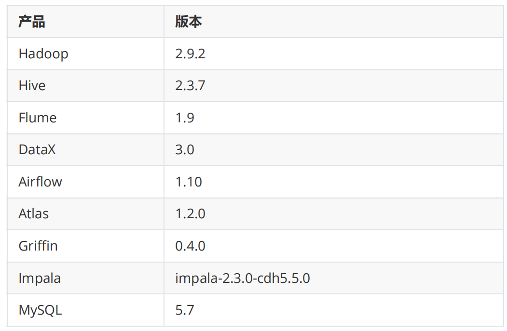
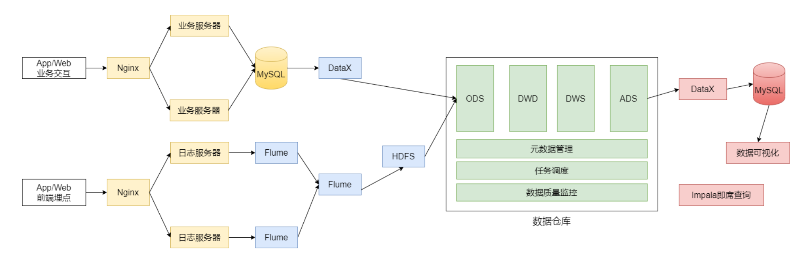
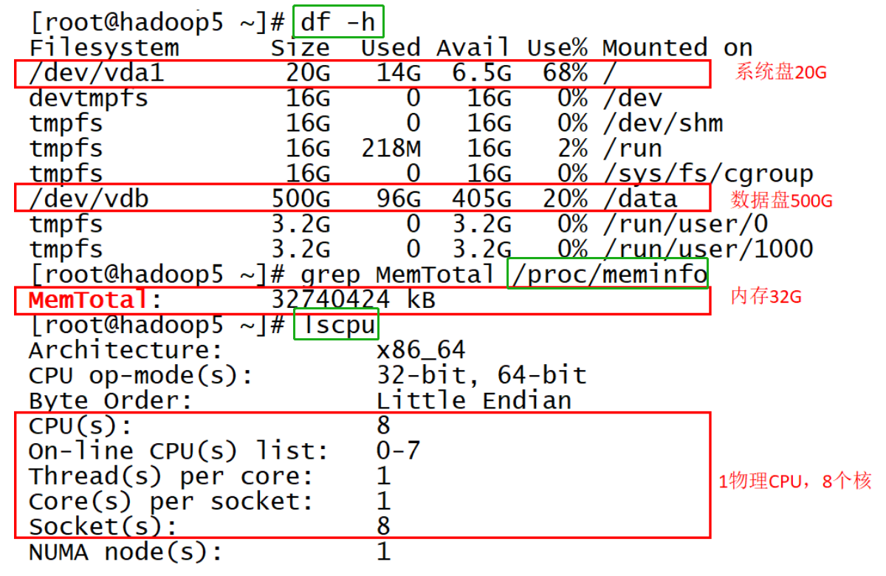
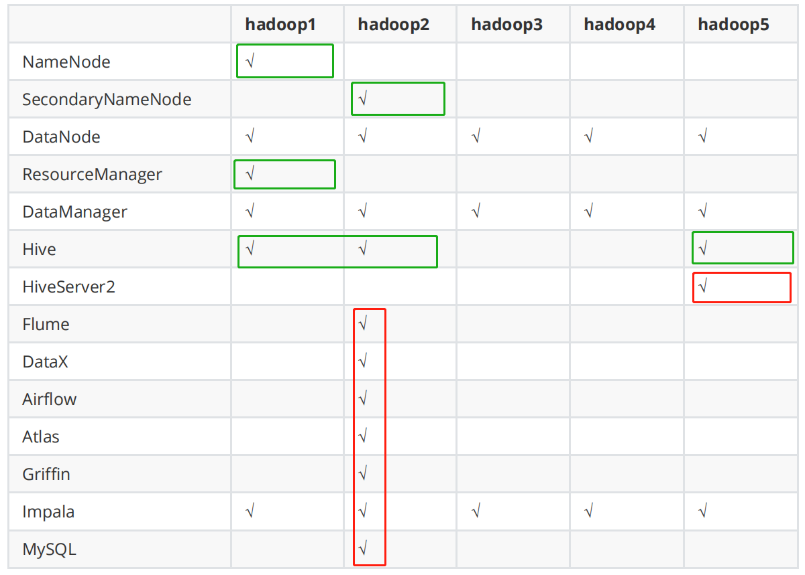

# 电商离线数仓设计

[电商离线数仓设计](#--------)

* [（一）需求分析](#-------)
    + [1、电商行业技术特点](#1---------)
    + [2、电商业务简介](#2-------)
* [（二）数据埋点](#-------)
* [（三）数据指标体系](#---------)
* [（四）总体架构设计](#---------)
    + [1、技术方案选型](#1-------)
        - [① 框架选型](#------)
        - [② 软件选型](#------)
        - [③ 服务器选型](#-------)
        - [④ 集群规模规划](#--------)
    + [2、系统逻辑架构](#2-------)
    + [3、开发物理环境](#3-------)
    + [4、数据仓库命名规范](#4---------)

 ## （一）需求分析

-   电商发展迅速，B2B电商交易额增长很快

### 1、电商行业技术特点

-   技术新
-   技术范围广
-   分布式集群、高并发、负载均衡
-   海量数据
-   业务复杂
-   系统安全

### 2、电商业务简介

-   网上商城主要分为：
    -   **网站前台**：网站首页、商家首页、商品详细页、订单支付页、秒杀频道等
    -   **运营商后台**：运营人员的管理平台（主要功能有：商家审核、品牌管理等）
    -   **商家管理后台**：入驻的商家进行管理的平台（主要功能有：商品管理、订单查询统计、资金结算等）

-   **数据库项目主要分析以下数据**
    -   **日志数据**：启动日志、点击日志（广告点击日志）
    -   **业务数据库的交易数据**：用户下单、提交订单、支付、退款等核心交易数据的分析

-   **数据仓库项目任务：**
    -   <u>**会员活跃度分析主题**</u>
        -   每日新增会员数；每日、周、月活跃会员数；留存会员数、留存会员率
    -   <u>**广告业务分析主题**</u>
        -   广告点击次数、广告点击购买率、广告曝光次数
    -   <u>**核心交易分析主题**</u>
        -   订单数、成交商品数、支付金额

## （二）数据埋点

-   数据埋点：将用户的浏览、点击事件采集上报的一套数据采集的方法
-   通过数据埋点，能够记录到用户在APP、网页上的一些行为，用于跟踪应用使用的状况，后续用来进一步优化产品或提供运营的数据支撑，包括访问数、访客数、停留时长、浏览数、跳出率。这样的信息收集大致分为两种：
    -   **页面统计**
    -   **统计操作行为**


-   企业经营中，数据分析辅助决策是很重要的一环，二埋点采集用户行为数据是此环节的基础。埋点工作流程分为：
    -   根据埋点需求完成开发（前端开发工程师 js）
    -   App或网页采集用户数据
    -   数据上报服务器
    -   **数据清洗、加工、存储**（大数据工程师负责）
    -   **根据相应指标进行数据分析**（大数据工程师负责）

-   在以上过程中涉及到的相关人员：
    -   埋点需求：数据产品经理、负责撰写需求文档，规定哪些区域、哪些用户操作需要埋点
    -   埋点采集：前端工程师，负责通过一套前端js代码对用户的请求事件采集到服务器
    -   **数据清洗、加工和存储：**对埋点中数据缺失、误报等情况进行清洗，并通过一定的计算加工，输出业务分析所需要的**结构化数据**，最后将数据存储到数据仓库中
    -   **数据分析：**在数仓中对数据进行整理，形成业务关注的指标
    -   前端展示：Java 开发


-   主流的埋点实现方法：（区别在于前端开发的工作量）
    -   **手动埋点**：开发需要手动写代码，一般需要公司自主研发的一套埋点框架
        -   优点：埋点数据更加精准
        -   缺点：工作量大，容易出错
    -   **无痕埋点**：使用第三方统计工具，自动将设备号、浏览器型号、设备类型等数据采集
        -   优点：简单便捷
        -   缺点：埋点数据统一，不够个性化和精确，埋点数据优劣取决于工具的优劣


## （三）数据指标体系

-   指标：对数据的统计值，如会员数、广告点击量等
-   **指标体系**：将各种指标系统地组织起来，按照业务模型、标准对指标进行分类和分层
-   没有数据指标体系的团队，其内部数据需求经常表现为需求膨胀以及非常多的需求变更。


-   由产品经理牵头，与业务、IT方协助，制定一套能从维度反映业务状况的一套待实施框架。建立指标体系时的三个原则：
    -   准确：核心数据理解到位
    -   可解释：所有指标都要配上明确且详细的业务解释
    -   结构性：能够充分对业务进行解读


-   **指标的构成：**
    -   **基础指标** + [修饰词] + **时间段**
        -   基础指标 不可拆分，如：交易额、支付金额
        -   修饰词 可选，是某种场景的表现，如：通过搜索带来的交易等
        -   时间段 即为一个时间周期，如：双十一期间、618活动期间


-   筛选完合理指标后，开始着手建立对应的指标体系，过程为：
    -   **理清业务阶段和需求**
        -   企业发展往往分三个阶段：
            -   **创业期**，最关注用户量，此时指标体系应紧密围绕用户量的提升来做维度的拆解
            -   **上升期**，除了关注用户量，更注重优化当前用户量结构，比如看用户留存率
            -   **成熟发展期**，更注重产品变现能力和市场份额，关注收入指标、各种商业化模式的收入，同时做好市场份额和竞品的监控
    -   **确定核心指标**
        -   每个APP的核心指标都不一样，但是很值得花时间区好好考虑这件事情！如今日头条，它的日活量和留存指标一定非常高，但仅关注这种指标不正确，其真正核心指标绝对不是单纯的日活量和留存。
    -   **对指标进行维度的拆解**
        -   核心指标的波动必然是由某种维度的波动引起的，要监控核心指标，本质上是要监控维度核心指标。
    -   **指标宣贯、存档和落地**
        -   完成整个指标体系搭建后，需告知所有相关业务人员
        -   对指标口径的业务逻辑进行详细的描述并存档
        -   建立核心指标的相关报表。在实际业务中，报表会在埋点前建好的，这样一来，版本一旦上线就能立刻看到数据，较为容易发现问题

## （四）总体架构设计

### 1、技术方案选型

#### ① 框架选型

Apache / 第三方发行版（CDH / HDP / Fusion Insight）

---

**Apache社区版本**

优点：

-   完全开源免费

-   社区活跃

-   文档、资料详实

缺点：

-   复杂的版本管理

-   复杂的集群安装

-   复杂的集群运维

-   复杂的生态环境

---

**第三方发行版本（CDH / HDP / Fusion Insight）**

Hadoop遵从Apache开源协议，用户可以免费地任意使用和修改Hadoop。正因如此，市面上有很多厂家在Apache Hadoop的基础上开发自己的产品。如Cloudera的CDH，Hortonworks的HDP，华为的Fusion Insight等。这些产品的优点是：

-   主要功能与社区版一致

-   版本管理清晰。比如Cloudera，CDH1，CDH2，CDH3，CDH4等，后面加上补丁版本，如CDH4.1.0 patch level 923.142 比 Apache Hadoop 在兼容性、安全性、稳定性上有增强。第三方发行版通常都经过了大量的测试验证，有众多部署实例，大量的运用到各种生产环境

-   版本更新快。如CDH每个季度会有一个update，每一年会有一个release基于稳定版本Apache Hadoop，并应用了最新Bug修复或Feature的patch提供了部署、安装、配置工具，大大提高了集群部署的效率，可以在几个小时内部署好集群

-   运维简单。提供了管理、监控、诊断、配置修改的工具，管理配置方便，定位问题快速、准确，使运维工作简单，有效

**CDH**：最成型的发行版本，拥有最多的部署案例。提供强大的部署、管理和监控工具。国内使用最多的版本；拥有强大的社区支持，当遇到问题时，能够通过社区、论坛等网络资源快速获取解决方法；

**HDP**：100%开源，可以进行二次开发，但没有CDH稳定。国内使用相对较少；

**Fusion Insight**：华为基于hadoop2.7.2版开发的，坚持分层，解耦，开放的原则，得益于高可靠性，在全国各地政府、运营商、金融系统有较多案例。


#### ② 软件选型

数据采集：**DataX**、**Flume**、Sqoop、Logstash、Kafka

数据存储：**HDFS**、HBase

数据计算：**Hive**、**MapReduce**、**Tez**、Spark、Flink

调度系统：**Airflow**、azkaban、Oozie

元数据管理：**Atlas**

数据质量管理：**Griffin**

即席查询：**Impala**、Kylin、ClickHouse、Presto、Druid

其他：**MySQL**


-   框架、软件尽量不要选择最新的版本，选择半年前左右稳定的版本。




#### ③ 服务器选型

选择物理机还是云主机？

-   机器成本考虑：物理机的价格 > 云主机的价格

-   运维成本考虑：物理机需要有专业的运维人员；云主机的运维工作由供应商完成，运维相对容易，成本相对较低；


#### ④ 集群规模规划

如何确认集群规模（假设：每台服务器20T硬盘，128G内存）

可以从计算能力(CPU、 内存)、**存储量**等方面着手考虑集群规模。

假设：

1、每天的日活用户500万，平均每人每天有100条日志信息

2、每条日志大小1K左右

3、不考虑历史数据，半年集群不扩容

4、数据3个副本

5、离线数据仓库应用


**需要多大集群规模？**

要分析的数据有两部分：日志数据+业务数据

每天日志数据量：500W * 100 * 1K / 1024 / 1024 = 500G

半年需要的存储量：500G * 3 * 180 / 1024 = 260T

通常要给磁盘预留20-30%的空间（这里取25%）： 260 * 1.25 = 325T

数据仓库应用有1-2倍的数据膨胀（这里取1.5）：500T

需要大约25个节点


其他未考虑因素：数据压缩、业务数据

-   以上估算的生产环境。实际上除了生产环境以外，还需要开发测试环境，这也需要一定数据的机器。


### 2、系统逻辑架构




### 3、开发物理环境

-   5台物理机；
-   500G数据盘；
-   32G内存；
-   8个core





-   在我的项目中，装有三个虚拟主机
    -   linux121 -- > hadoop1
    -   linux122 -- > hadoop5
    -   **linux123 -- > hadoop2**


关于数据集的说明：

1、在**开发**过程中使用**小规模数据集**

2、**模块测试**使用**真实的数据集**（数据量大）

3、在**做项目期间**根据自己实际情况使用不同的数据量（建议**使用小规模的数据集**）


### 4、数据仓库命名规范

```
1 数据库命名 
    命名规则：数仓对应分层 
	命名示例：ods / dwd / dws/ dim / temp / ads 

2 数仓各层对应数据库 
    ods层 -> ods_{业务线|业务项目} 
    dw层 -> dwd_{业务线|业务项目} + dws_{业务线|业务项目} 
    dim层 -> dim_维表 
    ads层 -> ads_{业务线|业务项目} (统计指标等) 
    临时数据 -> temp_{业务线|业务项目} 
备注：本项目未采用 

3 表命名（数据库表命名规则） 
    * ODS层： 
    命名规则：ods_{业务线|业务项目}_[数据来源类型]_{业务} 

    * DWD层： 
    命名规则：dwd_{业务线|业务项目}_{主题域}_{子业务} 

    * DWS层： 
    命名规则：dws_{业务线|业务项目}_{主题域}_{汇总相关粒度}_{汇总时间周期} 

    * ADS层： 
    命名规则：ads_{业务线|业务项目}_{统计业务}_{报表form|热门排序topN} 

    * DIM层： 
    命名规则：dim_{业务线|业务项目|pub公共}_{维度}
```


-   **创建数据库**

    -   用的是什么数据库？ 
    -   答案：**Hive**

    ```mysql
    create database if not exists ods; 
    create database if not exists dwd; 
    create database if not exists dws; 
    create database if not exists ads; 
    create database if not exists dim; 
    create database if not exists tmp;
    ```

